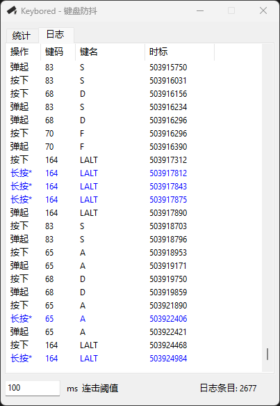

# Keybored - 键盘防抖工具

一个本用于修复键盘连击问题的Windows桌面工具，加入了喷薄而出的彩蛋特效，我愿称之为“键下生花”。（基于 [aardio](https://www.aardio.com/) 开发）

## 功能特性

- **键盘抖动屏蔽** — 检测并屏蔽因键盘硬件问题导致的连击（chattering），可自定义阈值（1~2000ms）
- **实时日志** — 记录所有按键事件，屏蔽（红色）、长按（蓝色）彩色标注
- **统计面板** — 按键抖动次数、连击间隔统计，按频率排序
- **最小化托盘** — 关闭窗口自动最小化到系统托盘，右键菜单操作

## 下载安装

从 [Releases](https://github.com/jiezg/Keybored/releases) 页面下载最新版 `Keybored.exe`，无需安装，直接运行。

### 操作类型说明

| 标注 | 颜色 | 含义 |
|------|------|------|
| 按下 | 默认 | 首次按下，正常放行 |
| 弹起 | 默认 | 按键释放 |
| 长按* | 蓝色 | 长按产生的重复按键，不屏蔽 |
| 屏蔽 | 红色 | 检测到抖动连击，已屏蔽 |

## 开发环境

- [aardio](https://www.aardio.com/) v36+

## 运行环境

- Windows 11/10/7...?

## 开源协议

[MIT License](LICENSE)
