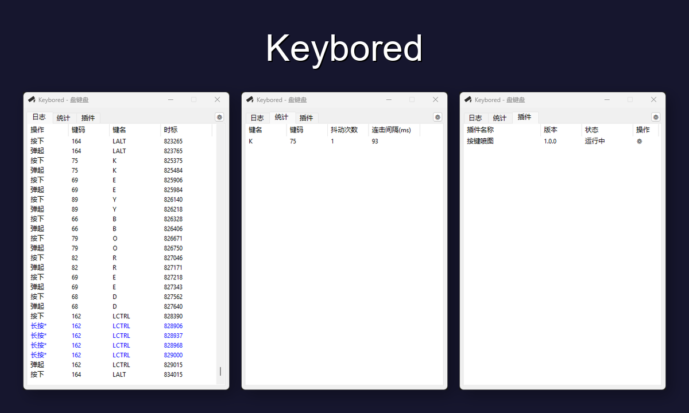

# Keybored - 一起盘键盘吧！

最早是用于修复键盘连击问题的Windows小工具，后来键盘换了又不想把这个项目废弃掉，就加入了一些有意思、搞抽象的功能。
基于 [aardio](https://www.aardio.com/) 开发，之后由人工+AI共同维护，不断优化、迭代、扩展，也算是vibe coding的有益尝试。

## 功能特性

- **抖动屏蔽** — 检测并屏蔽因键盘按键连击（chattering），可自定义阈值
- **实时日志** — 记录所有按键事件，并分类标注
- **统计面板** — 展示键抖动次数、连击间隔等，发现键盘中的坏键
- **驻留托盘** — 关闭窗口自动最小化到系统托盘，右键菜单操作
- **插件系统** — 支持动态加载插件(aardio)，发挥想象充分扩展

## 下载安装

从 [Releases](https://github.com/jiezg/Keybored/releases) 页面下载最新版压缩包，解压后运行 `Keybored.exe`。

> 注意：请确保 `plugins/` 目录与 `Keybored.exe` 在同一目录下，否则插件无法加载。

### 操作类型说明

| 标注 | 颜色 | 含义 |
|------|------|------|
| 按下 | 默认 | 首次按下，正常放行 |
| 弹起 | 默认 | 按键释放 |
| 长按* | 蓝色 | 长按产生的重复按键，不屏蔽 |
| 屏蔽 | 红色 | 检测到抖动连击，已屏蔽 |

## 开发环境

- [aardio](https://www.aardio.com/) v36+

## 运行环境

- Windows 11/10/7...?

## 开源协议

[MIT License](LICENSE)
